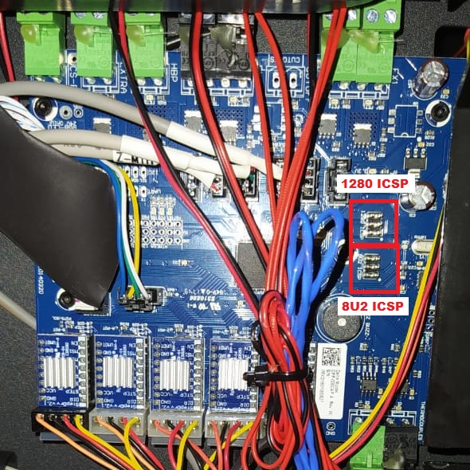
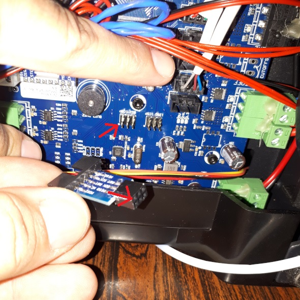
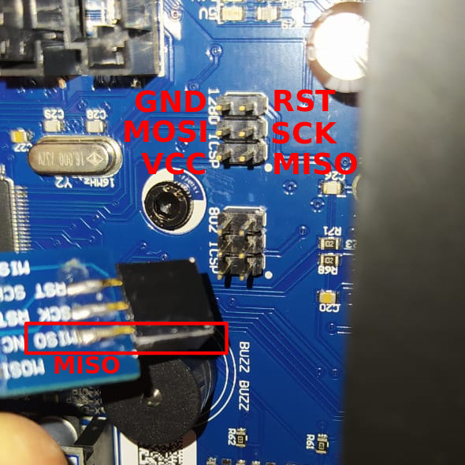

# Bootloader for Flashforge Creator Pro Motherboard

The FFCP motherboard used in this steps is the **FF_CreatorBoard_REV D 20140320**. This motherboard is based on a MightyBoard with ATMEGA2560, so possibly any MightyBoard-based motherboard will work with this procedure.

## :warning: USE AT YOUR OWN RISK :warning:
By using this guide you are fully aware of the risks involved by such modifications. I hereby take no responsibility for any loss and/or damage to property and/or personnel involved.

## Procedure

> I recommend upgrade your USBasp for the last version (usbasp.2011-05-28). There are a lot of information about it on the internet, but [this tutorial](https://atmega32-avr.com/firmware-upgrade-for-usbasp-clone-fixing-error-setting-usbasp-isp-clock/) or [these steps](https://www.instructables.com/How-to-Update-the-Firmware-on-a-Cheap-USBasp-Clone/) are a good start point.

1. Install [AVRDUDE](https://github.com/avrdudes/avrdude) to your computer.

2. Either clone this repository locally, or download the [`Bootloader/`](./) folder.

3. Access the printer's motherboard.  Lay the printer down or put it upside down and remove the screws on the bottom metal plate, then take the plate off. Locate the "8U2 ICSP" and "1280 ICSP" 6-pin header connector.



4. Connect the USBasp cable to the "8U2 ICSP" port, ensuring it is oriented correctly (the MSIO pin on the adapter should align with the white dot on the motherboard). The picture below shows the reference pin.





> [!NOTE]
> Ensure that the motherboard is powered. The USBasp cable should provide sufficient power, but if it does not, you will need to supply power otherwise.

5. Open a command terminal and navigate to the downloaded `Bootloader/` folder.

7. Load the 8U2 with bootloader and set proper lock bits using this command:

```bash
avrdude -v -p m8u2 -P usb -c usbasp -U flash:w:8U2_firmware/Makerbot-usbserial.hex:i -U lfuse:w:0xFF:m -U hfuse:w:0xD9:m -U efuse:w:0xF4:m -U lock:w:0x0F:m 
```

> [!NOTE]
> If the command is unsuccessful with the message `Error in USB Receive`, try running the command again.  It sometimes takes a few tries.

8. Take the USBasp cable out and connect it to the "1280 ICSP" port (again, make sure it's oriented correctly; the orientation is the same).

9. Unlock the memory on your target board and erase the flash (if nessessary). You can also set the fuse bits at the same time with this command:

```bash
avrdude -v -p m2560 -c usbasp -P usb -U lock:w:0x3F:m -U efuse:w:0xFD:m -U hfuse:w:0xD8:m -U lfuse:w:0xFF:m -e
```

10. Load the ATMEGA2560 with the bootloader, and set proper lock bits using this command:

```bash
avrdude -v -p m2560 -P usb -c usbasp -U flash:w:MightyBoardFirmware-2560-bootloader/stk500boot_v2_mega2560.hex:i -U lock:w:0x0f:m
```

11. Disconnect 

## About the [dcnewman](https://github.com/dcnewman/MightyBoardFirmware-2560-bootloader) Distribuion

We are using firmware for the 8U2 chip that was developed by the Arduino team.

This firmware translates virtual Serial DTR line toggles to a RESET output that connects to the reset pin on the Atmega1280. Serial implementations on Mac OSx and Linux pull the DTR line down on connect and release it on disconnect.

Mirroring the DTR to the 1280 reset means that the Bot will reset when it is connected to ReplicatorG. This is undesireable behavior if the Bot is in the middle of a print.

The new firmware ignores virtual DTR line changes. It pulls the RESET line down when it recieves a new connection with a baud rate of 56700.

57600 is the baud rate we use for firmware updates. The RESET line is set high for all other baud rates. Normal communication with the bot uses 115200 baud.

## Recompile the .hex files

To recompile the .hex files check the source repositories:

* [8U2_firmware](https://github.com/makerbot/MightyBoardFirmware/tree/master/bootloader/8U2_firmware)
* [MightyBoardFirmware-2560-bootloader](https://github.com/dcnewman/MightyBoardFirmware-2560-bootloader)
