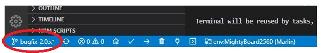
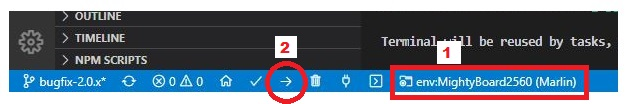
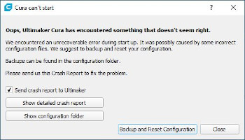
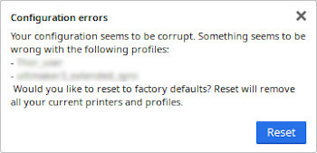

# Flashforge Creator Pro with Marlin and Cura
Quick guide on converting FlashForge Creator Pro running Sailfish firmware to the Marlin 2.0.x firmware and use Makerbot Cura slicer.

## :warning: USE AT YOUR OWN RISK :warning:
By using this guide you are fully aware of the risks involved by such modifications. I hereby take no responsibility for any loss and/or damage to property and/or personnel involved.

This setup was tested using:
- Ultimaker Cura 4.8.0
- Marlin bugfix-2.0.x (branch hash fd247792 on Feb 13 2021)
- Flashforge Creator Pro (FF_CreatorBoard_REV D 20140320)
- Compiled, flashed and sliced by Windows 10 (yes, I know...)

## Credits

This setup was based on
- [8U2_firmware](https://github.com/makerbot/MightyBoardFirmware/tree/master/bootloader/8U2_firmware) by makerbot
- [MightyBoardFirmware-2560-bootloader](https://github.com/dcnewman/MightyBoardFirmware-2560-bootloader) by dcnewman
- [FFCP_Marlin_Conversion ](https://github.com/ketukil/FFCP_Marlin_Conversion) by ketukil
- [Marlin Configuration 2.0 files for FFCP with a BLTouch](https://gist.github.com/justacec/18c985e9d84fd60a3c207b6146691293) by justacec (special thanks)
- [Flashforge-for-Cura](https://github.com/eugr/Flashforge-for-Cura) by eugr

## TODO

:warning: This project has no a stable version yet (Feb/06/21)

- In Cura, the gray area on plate (not printable area) is showing inside the printable volume
- Proceed tests using only left extruder
- Proceed tests using both extruders in the same print
- Improve the wipe nozzle procedure

## Tools

- [USBasp](https://www.google.com/search?client=any&q=Usbasp)
- [10 to 6 USBasp Adapter](https://www.google.com/search?client=any&q=Usbasp+10+to+6+adapter) (if your USBasp doesn't have)
- [AVRDUDE](https://www.nongnu.org/avrdude/)
- [Visual Studio Code](https://code.visualstudio.com/)
	- [PlatformIO](https://platformio.org/)
	- [Auto Build Marlin](https://marlinfw.org/docs/basics/auto_build_marlin.html)
- [Arduino IDE](https://www.arduino.cc/en/guide/windows#toc1) (only to get the USB drivers)

## Marlin Procedure

1. Go to [Bootloader README](Bootloader/README.md) and follow the instructions to flash the bootloaders.

2. Clone [Marlin Github repository](https://github.com/MarlinFirmware/Marlin/) locally.

3. Open Marlin cloned repository folder in [VSCode](https://code.visualstudio.com/) ([PlatformIO](https://platformio.org/) and [ABM](https://marlinfw.org/docs/basics/auto_build_marlin.html) installed).

4. Chose your desired branch (I recommend the bugfix-2.0.x).

5. Replace the Configuration.h, Configuration_adv.h and Version.h with the files in this repository folder: [Marlin/](./Marlin).

6. Change the lines below, if you want:
	* Version.h
		* #define STRING_DISTRIBUTION_DATE "2019-07-10"
			* uncomment and change the date -> strong recomendation
	* Configuration.h
		* #define STRING_CONFIG_H_AUTHOR "(none, default config)"
			* good practice if you share these files 

7. Connect the printer USB cable on the computer.

> Make sure that the drivers are installed. If you get any issue about it, try to install Arduino IDE (you can select only to install the drivers).

8. Flash Marlin in FFCP
	
	1. Select the "MightyBoard2560 (Marlin)" environment
	2. Build and Upload

## Cura Procedure

### **Into local AppData**

Preferred for single-user installations. This is a preferred way as it should survive application updates.

1. Open Cura library folder located at `C:\Users\your_username\AppData\Roaming\cura\4.X` (check your current version).

2. Copy definitions, extruders and meshes files from this cloned repository into the respective folders opened. You may need to create `meshes` folder first.

### **Into application folder**

If you have multiple user accounts on your PC that need to use this printer

> **Tip:** You will need an Administrator access

1. Open Cura application resources folder located at `C:\Program Files\Ultimaker Cura 4.X.X\resources` (check your current version).

2. Copy definitions, extruders and meshes files from this cloned repository into the respective folders opened.

> **Atention:** If you change this folder, Cura can show you a message like "Can't Start" or "Configuration Error". It will reset your setings (make Cura as if it has just been installed)! Make sure that you have backup of your Material, Machine and Print Profiles.
>
>
>
>

## Finishing

Launch Cura and click on Add Printer in the printer selection dropdown. You should be able to see FlashForge Creator Pro in the list.

In Cura the extruder 1 is right and extruder 2 is left. The easiest way to disable/enable specific extruder is to go to Settings menu and do it from there as they are named properly in it.

In FFCP disply menu the extruder 0 is right and extruder 1 is left.

## Changelog

v0.1 (Mar 05, 2021) - Initial commit with original contents

